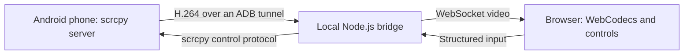

# Architecture



The browser can be a standalone Chromium tab or a supported Codex browser panel.

DroidDock is a small browser client and local Node.js bridge around the unmodified scrcpy device server. It does not capture the desktop scrcpy window or re-encode video. Windows is the supported host for the supplied discovery and lifecycle scripts.

## Data flow

```text
Android phone                  Windows host                     Browser
scrcpy 4.1 server  -- ADB -->    Node.js bridge  -- WebSocket -->  WebCodecs + canvas
                  <--          structured controls              <-- input events
```

The phone encodes H.264. ADB forwards the session's random scrcpy socket to a dynamically allocated loopback port. The bridge parses scrcpy framing and forwards codec/session metadata and media packets. The browser decodes frames using WebCodecs and renders them on a canvas. Input travels in the reverse direction as a small set of structured messages serialized into the pinned scrcpy control protocol.

## Repository map

| Location | Responsibility |
| --- | --- |
| `src/droiddock/protocol.ts` | Version/hash constants, incremental video framing, control validation and serialization. |
| `src/droiddock/session.ts` | Verified phone discovery, pinned server launch, ADB forward, video/control sockets, resource cleanup, and a fixed sanitized startup-progress vocabulary. |
| `src/droiddock/server.ts` | Loopback HTTP assets, request validation, WebSocket ownership, session lifecycle, current-session progress, status. |
| `src/droiddock/config.ts` | Local config and environment overrides. |
| `src/process.ts` | Bounded subprocess execution. |
| `droiddock/public/` | Browser UI, WebCodecs decoding, input events, optional local stream statistics, styles. |
| `droiddock/vendor/scrcpy-4.1/` | Unmodified server, upstream license, and provenance/checksum manifest. |
| `scripts/setup.mjs` | Installation preparation, config/device selection, service inspection. |
| `scripts/launch.mjs` | Detached service launch/reuse. |
| `scripts/phone.mjs` | Narrow open/status/disconnect helper for local integrations. |
| `scripts/*.ps1` | Windows bootstrap, discovery, and entry points. |
| `scripts/Test-DroidDock.mjs` | Baseline and opt-in live diagnostics. |
| `droiddock/tests/` | Offline protocol, boundary, ownership, setup, lifecycle, diagnostic, keyboard/focus, fullscreen, startup-progress, and stream-statistics tests. |

## Ownership and lifecycle

Only one browser WebSocket controls a service's phone session. An explicit Connect action opens a takeover-capable connection; the old view is notified and becomes inactive. Input and disconnect messages are accepted only from the current owner. Old socket-close events must not stop a newer session.

Each session gets its own random socket identifier, temporary device-server file, and ADB forward. Cleanup must remain scoped to those resources and finish before a replacement phone session starts. Sanitized startup-progress messages are applied only while that session is still current and the service is still connecting; they do not change the connected or rendered success criteria. Shared ADB and unrelated scrcpy processes are not reset. Closing a controlling browser releases the phone session; the HTTP service stays available. Graceful service shutdown closes its client and cleans up its session.

Installation and configuration identifiers let helpers distinguish a service for this checkout/settings from an unrelated listener or different checkout. They are matching aids, not secrets or authorization tokens. Configuration changes require service restart.

## Browser and request boundaries

The service uses `127.0.0.1`, Host/Origin validation, custom-header control POSTs, an asset allowlist, and CSP. WebSockets require the exact local Origin. Browser connect/disconnect actions are bound to the owning socket; helper HTTP actions follow their separate guarded path. Read the actual request handlers before modifying this distinction.

Optional stream statistics are computed in the browser from observed media-packet bytes, drawn frames, and `decodeQueueSize`. They are not sent to the service and are not a substitute for inspecting rendered video.

Structured controls validate sizes and ranges before serialization. Explicit paste is capped at 65,536 UTF-8 bytes; fallback text injection is capped at 300. The WebSocket payload allowance accounts for JSON escaping. Slow browser delivery and congested control output trigger bounded failure instead of unlimited buffering.

These checks constrain browser behavior but do not protect against hostile local processes that can construct their own requests. See [SECURITY.md](../SECURITY.md).

## scrcpy upgrades

There is no scrcpy source fork to merge. The adapter depends on an internal, version-specific protocol, so replacing the server binary alone is unsafe.

1. Obtain the new server from an official [scrcpy release](https://github.com/Genymobile/scrcpy/releases) and add a versioned vendor directory.
2. Preserve upstream licenses and record provenance and SHA-256 in its manifest. Verify the file against the intended upstream artifact.
3. Inspect the release's protocol and server options. Update framing/control serialization, version/hash constants, vendor paths, diagnostics, and documentation as needed.
4. Add or update regression tests for changed wire behavior. Run typecheck, build, and offline tests.
5. On a Windows host with an authorized test phone, check rendered video, tap/drag, keyboard/paste, rotation, handoff, disconnect/reconnect, closed-tab cleanup, connection loss, and coexistence with other ADB sessions. Check that session-owned forwards are removed.
6. Keep the previous vendor files until the replacement passes the required checks; document the upgrade and validation in the pull request.

Never silently select whichever scrcpy server happens to be installed on the host. The bundled binary's startup checksum check and diagnostic manifest checks must remain consistent.

## Evidence boundaries

Offline tests use synthetic protocol data, local HTTP/WebSocket interactions, and injected/mocked device dependencies. They establish the tested behaviors, not real phone/browser compatibility. Live diagnostics establish metadata/frame-packet evidence; actual rendered video needs browser inspection. Report those layers separately when validating a change. [COMPATIBILITY.md](COMPATIBILITY.md) is the published record of those layers.
